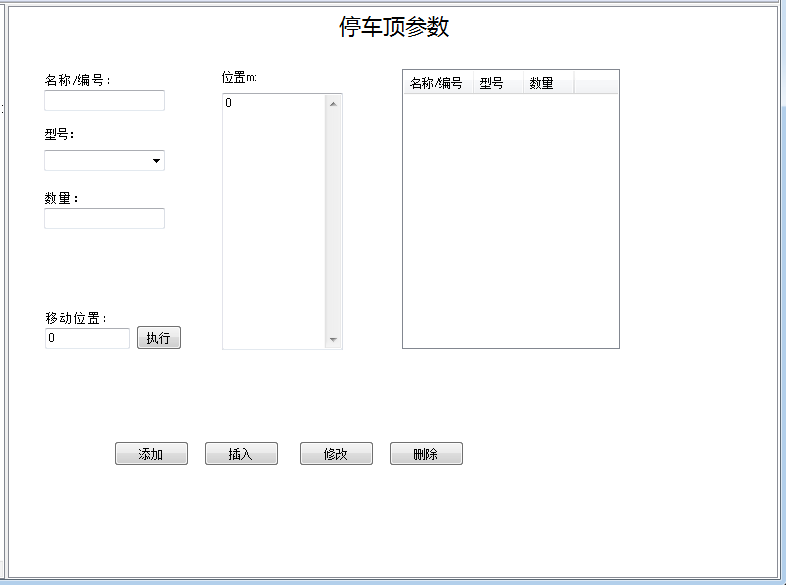

# 停车顶
  
&emsp;&emsp;停车顶编辑页面分为两部分：

- 停车顶列表；
- 停车顶参数编辑区。

## 停车顶列表

&emsp;&emsp;停车顶列表列出了所有停车顶，可以根据需要通过勾选最前端的选择框选择其中的一个组成线路数据进行验算。

## 停车顶参数编辑区

&emsp;&emsp;由于停车顶的位置要求特殊，停车顶的位置可以逐个填写在“位置”栏内。如果位置数据少于数量，则按照最后一个间距设置后续的停车顶位置。