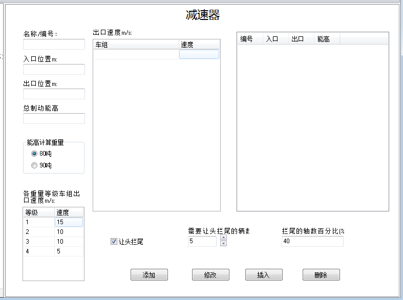

# 减速器
  
&emsp;&emsp;减速器编辑页面分为两部分：

- 减速器列表；
- 减速器参数编辑区。

## 减速器列表

&emsp;&emsp;减速器列表列出了所有减速器，可以根据需要通过勾选最前端的选择框选择其中的一个组成线路数据进行验算。

## 减速器参数编辑区

&emsp;&emsp;由于减速器的出口速度需要与车辆数据相对应，在出口速度列表中会显示车组的简要信息和其对应的出口速度。车组的选择对减速器的出口速度列表中的内容会产生影响。