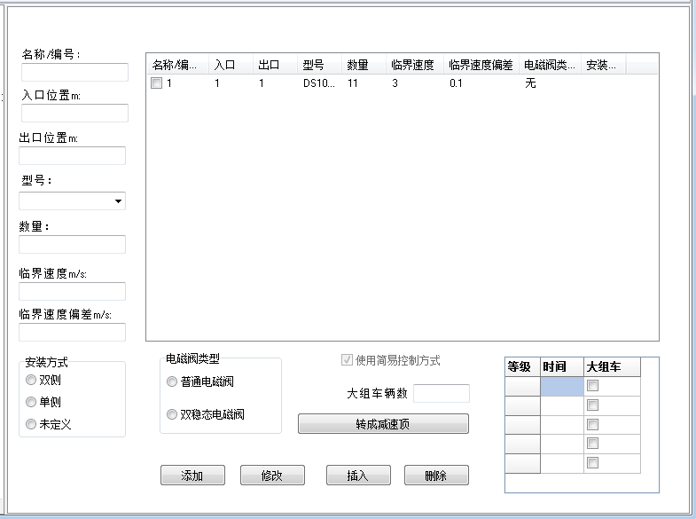

# 可控顶
  
&emsp;&emsp;可控顶编辑页面分为两部分：

- 可控顶列表；
- 可控顶参数编辑区。

## 可控顶列表

&emsp;&emsp;可控顶列表列出了所有可控顶，可以根据需要通过勾选最前端的选择框选择其中的一个组成线路数据进行验算。

## 可控顶参数编辑区

&emsp;&emsp;可控顶列表内不显示可控顶的控制数据。只有双击可控顶列表时，才会在可控顶编辑区内的控制数据表中显示该段可控顶的控制数据。控制数据是按照重量等级设置的，重量等级由设置编辑页面中的重量等级的数量决定的；时间为该段可控顶的控制时间，如果为0，则不控制；大组车选项决定大组车是否进行控制。