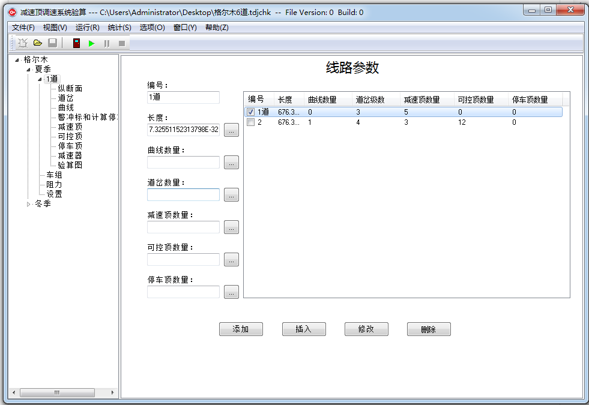
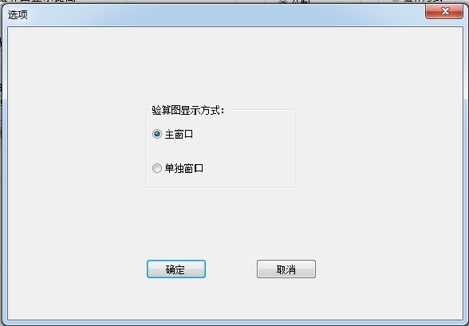

# 操作界面

&emsp;&emsp;主窗口界面可分为三部分，顶部为菜单和工具条；左侧为导航栏；右侧为数据编辑页面。

## 菜单和工具条

## 导航栏

&emsp;&emsp;导航栏按照车场名，工况，线路等分级组织验算数据和验算图。车场名下分工况，可以有多个工况，例如图中所示，分为夏季和冬季两个工况。每个工况下可以有股道、车组、阻力和设置项，其中股道可以有多个；每个股道下分成：纵断面、道岔、曲线、警冲标和计算停车点、减速顶、可控顶、停车顶、减速器和验算图。

&emsp;&emsp;通过这些项可以切换右侧的数据编辑页面。

## 数据编辑页面

&emsp;&emsp;数据编辑页面根据左侧导航栏中的选择而切换到不同页面。

## 选项

&emsp;&emsp;通过菜单可以调出“选项”窗口，在这个窗口中可以设置验算图显示位置（主窗口或单独窗口）。

