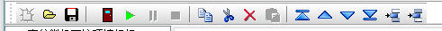
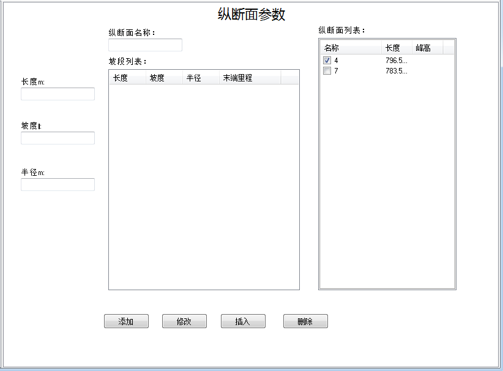
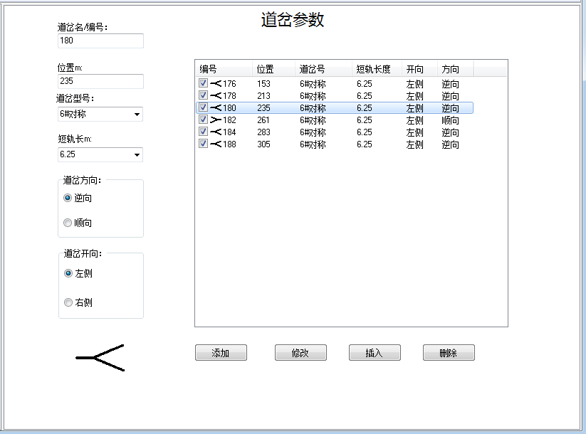

#更新内容

## 1.9

编辑方式改变较大。上一版本使用“修改”、“添加”等按钮更新修改后的数据。这个版本在工具条上增加了“复制”、“粘贴”、“上移”、“下移”、“插入”等按钮，用于编辑数据列表。

通过点击、选择列表中的数据行，将该行的数据显示在编辑区内。在编辑区内的改动都会动态更新到数据列表中。

上图为新版软件工具条。后面的10个工具按钮为新增的。分别为：复制、剪切、删除、粘贴、移至顶端、上移一行、下移一行、移至低端、选择行上面插入和选择行下插入一行。

这10个按钮只有在相应的数据表激活时才会处于激活状态。

##1.8.3

- 纵断面编辑方式改为列表内修改。
- 在纵断面中增加了：高程、高差和坡段类型（平台、打靶区等），并根据类型自动计算峰高。
- 修改了数据文件格式。

纵断面编辑方式改为列表内修改，可在纵断面坡段列表内直接编辑，完成编辑后自动计算坡段末端的高程、与最高点的高差、峰高等内容。

如果各坡段没有定义平台，则不计算峰高，峰高栏内显示为0。如果存在打靶区，则峰高为打靶区末端与平台的高差，如果不存在打靶区则峰高为顶群坡末端与平台的高差，如果打靶区和顶群坡都不存在则不计算峰高。

编辑高程后会自动根据最后编辑的高程更新其他坡段末端高程，并将最后编辑的高程用红色字体标示，但是该单元格处于选择状态时，没有红色字体标示。

##1.8.2

- 修复设置页面编辑数据时的错误。
- 统计数据可以根据不同工况、股道进行切换。
- 修复验算图状态下选择数据编辑页时，有时没有反应的问题。

##1.8.1
- [多股道的数据管理](#多股道的数据管理)。
- [增加多纵断面的编辑功能](#增加多纵断面的编辑功能)。
- 纵断面显示了坡段的末端里程。
- [重新设计减速器出口速度设置功能](#重新设计减速器出口速度设置功能)。
- [优化道岔的编辑界面](#优化道岔的编辑界面)。
- [TDJ2006减速顶制动功](#TDJ2006减速顶制动功)。
- [修改了数据文件格式](#修改了数据文件格式)。
- [增加了线路的示意图](#增加了线路的示意图)。

###多股道的数据管理

道岔、曲线、减速顶等数据可以多股道共用。但在验算时仍然只能同时验一股道，不能同时多股道验算。数据组织格式发生变化，同一工况内可以有多股道；每个股道内可以共用数据。

###增加多纵断面的编辑功能

为了适应多股道数据管理，纵断面编辑页面增加了一个纵断面列表，底部的“添加”、“修改”、“插入”和“删除”按钮有双重功能。即可一个操作纵断面中各坡段数据，也可以操作纵断面列表。**在点击这几个按钮之前要点击一下你打算操作的列表**，点击列表时列表的边框会变成双实线。如图中所示，“纵断面列表”的边框为双实线，此时“添加”将会将纵断面的“坡段列表”中的纵断面添加到“纵断面列表”中。如果“坡段列表”处于双实线状态，“添加”按钮将会将“长度”、“坡度”和“半径”合成一个坡段添加到“坡段列表”中。

在“坡段列表”中增加了一个“末端里程”，这个数据是表示该坡度末端距离纵断面起点的距离。

###重新设计减速器出口速度设置功能

减速器编辑页面中，出口速度列表变成与车组相对应设置的方式，同时增加了“各种重量等级车组出口速度”列表。

车组改变后，出口速度列表中车组一列也会相应变化。车组对应的出口速度如果为“-1”，则会按照重量等级进行控制。

**重量等级控制只有车组对应的出口速度为“-1”时才有效。**

###优化道岔的编辑界面

增加了道岔示意图。

道岔开向根据道岔型号而自动改变。选择对称道岔时，“道岔开向”中显示“左侧”和“右侧”；选择单开道岔时，显示“直向”和“侧向”。

道岔在平面示意图上的显示是根据道岔型号和开向自动选择的。

###TDJ2006减速顶制动功

原TDJ2006改为TDJ2006U制动功为1250J，新增一个TDJ2006制动功为1050J。原TDJ2006为美国市场使用的，应该为TDJ2006U，此版本做此修订。**以前版本的数据文件中的TDJ2006，在此版本中将显示TDJ2006U，如果是国内使用应该改为TDJ2006。**

###修改了数据文件格式

此版本保存的数据文件采用了新的数据格式，以前版本的程序无法正确打开。但此版本的程序能够打开老版本的数据文件（需要核实道岔的型号和TDJ2006的问题），在新版的数据文件中可以保存多股道数据。

###增加了线路的示意图

在线路页面中增加了线路的示意图。点击线路列表中某个线路时，页面底部将显示出该线路的示意图。示意图包括平面示意图和纵断面坡段。

*平面示意图不全，没有警冲标和尾部计算停车点，将在未来某个版本中补充。*