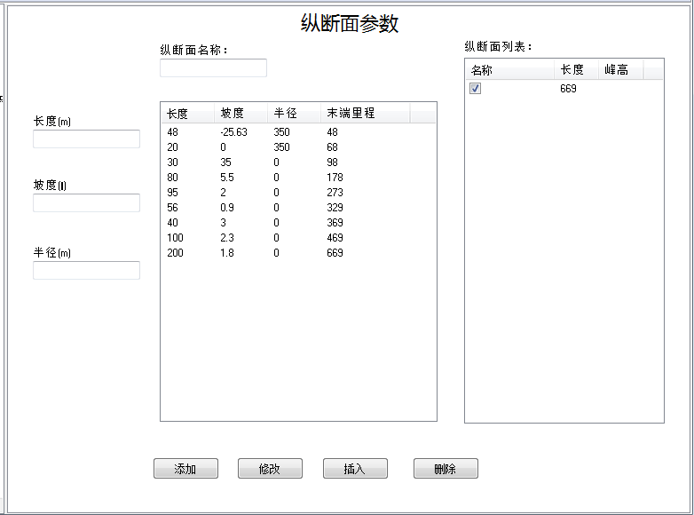

# 纵断面

&emsp;&emsp;纵断面编辑页面分成三部分：

* 纵断面列表
* 纵断面坡段列表
* 纵断面坡段编辑

## 纵断面列表

&emsp;&emsp;纵断面列表中列出了所有纵断面，可以根据需要通过勾选最前端的选择框选择其中的一个组成线路数据进行验算。

## 纵断面坡段列表

&emsp;&emsp;该列表列出某个纵断面的完整坡段，表中列出了各坡段的长度、坡度、竖曲线半径（与下一段坡段连接的竖曲线）和末端的里程（从第一段坡的起点开始）。  
&emsp;&emsp;通过“添加”、“插入”和“修改”按钮可以更新纵断面列表中的纵断面数据。  
&emsp;&emsp;通过“删除”按钮可以删除选择的坡段数据。

## 纵断面坡段的编辑

&emsp;&emsp;在纵断面坡段编辑区内，可以编辑坡段的长度、坡度和竖曲线半径。通过“添加”、“插入”和“修改”按钮可以更新纵断面坡段列表中的坡段数据。  
