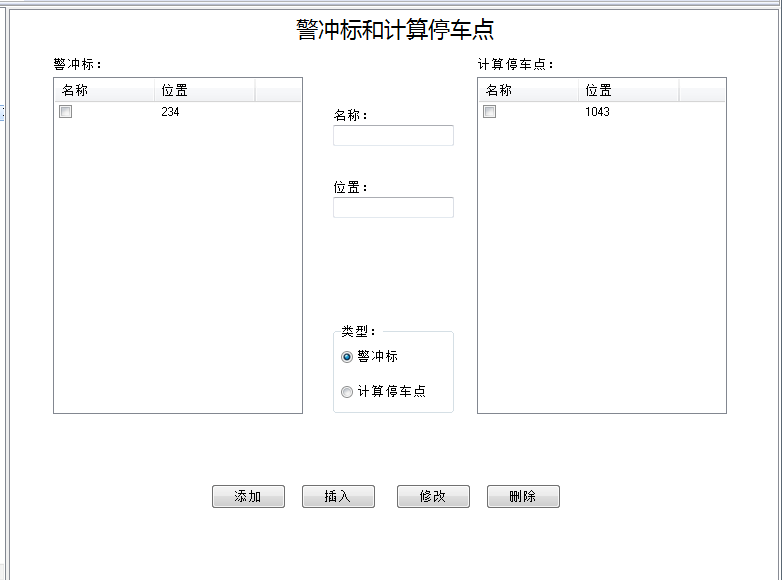

# 警冲标和计算停车点

&emsp;&emsp;警冲标是针对驼峰头部的警冲标；计算停车点是指线路尾部车辆不可越过的标志点，横向分区时，这个计算停车点是指分区点，纵向分区时这个计算停车点是指尾部警冲标。

&emsp;&emsp;警冲标和计算停车点编辑页面分为三部分：

- 警冲标列表；
- 计算停车点列表；
- 参数编辑区。

## 警冲标列表

&emsp;&emsp;警冲标列表列出了所有警冲标，可以根据需要通过勾选最前端的选择框选择其中的一个组成线路数据进行验算。

## 计算停车点列表

&emsp;&emsp;计算停车点列表列出了所有计算停车点，可以根据需要通过勾选最前端的选择框选择其中的一个组成线路数据进行验算。

## 参数编辑区

&emsp;&emsp;在参数编辑区可以编辑参数的名称和位置数据。并根据数据类型的选项来决定点击“添加”、“插入”和“修改”按钮时，参数编辑区内的数据更新到相应的列表中。
