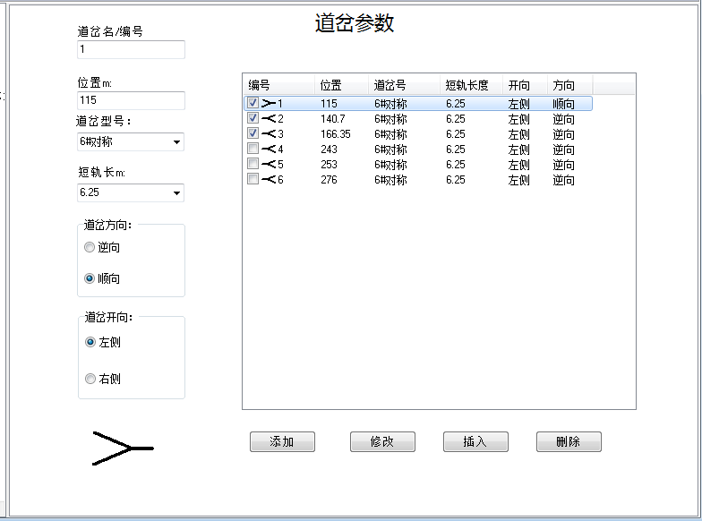

# 道岔

&emsp;&emsp;道岔种类繁多，但在编组场使用的道岔种类不多，最常用的就是6#对称道岔和9#单开道岔。不常用的还有：7#三开道岔、菱形交叉。还有现在已经不再使用的道岔：6#单开、7#单开、6.5#对称和9#对称。为了适应老车场的情况将这些道岔都加到程序中。

&emsp;&emsp;分路道岔前的绝缘短轨长度一般为7米、6.5米。个别情况也有4.5米的。  
  
&emsp;&emsp;道岔编辑页面分为两部分：

- 道岔列表；
- 道岔参数编辑区。

## 道岔列表

&emsp;&emsp;道岔列表列出了所有道岔，可以根据需要通过勾选最前端的选择框选择其中的一个组成线路数据进行验算。

## 道岔参数编辑区

&emsp;&emsp;在道岔参数编辑区可以选择道岔的型号、分支和方向；编辑道岔中心的位置和岔前绝缘短轨的长度。

&emsp;&emsp;在道岔型号、道岔方向或道岔开向改变时，道岔示意图也会改变。

&emsp;&emsp;不同的型号，道岔开向中的内容也会有所不同。对称道岔时，道岔开向会显示左侧和右侧；单开道岔时，会显示直向和侧向。

&emsp;&emsp;*菱形交叉也会显示左侧和右侧，但只影响示意图的显示，不会对验算结果产生影响。*

